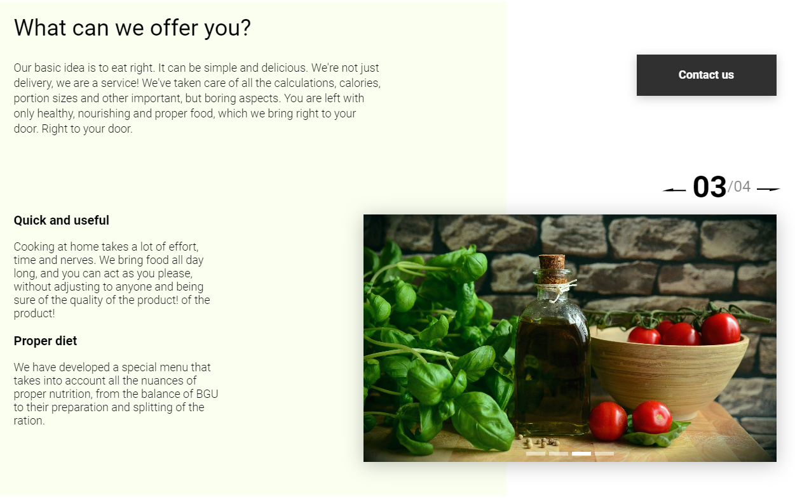
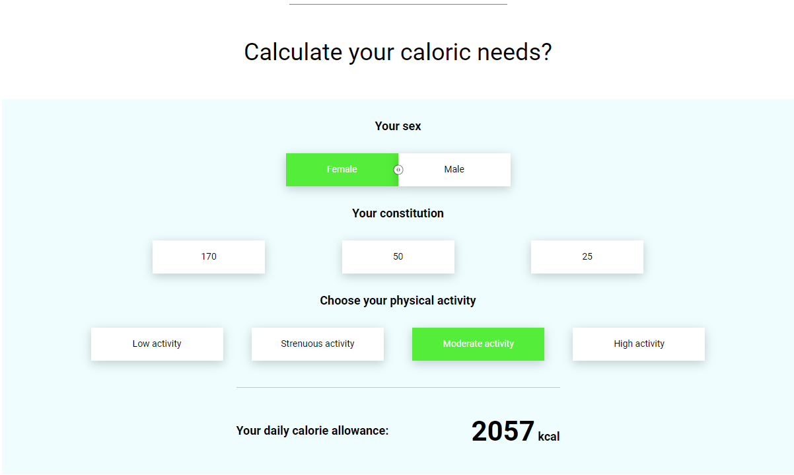

# Web App - "Healt Menu"

Stack: Java Script / HTML / CSS / Webpack / Json-server / Node / Babel

\
Web application with various modules:
- Feedback forms: use json-server;
- "Tabslider";
- "Slider";
- "Calculator Calorie calculator";
- Сards menu lading via json-server;
- Various timers, etc.

Before start, Node.js should be installed.

## Json-server

Feedback forms and menu cards

Instal Json-Server:
```
npm install json-server
```

Start Json-server:
```
npx json-server db.json
```


### Example app blocks

"Slider"\
 

"Calculator"\
 

